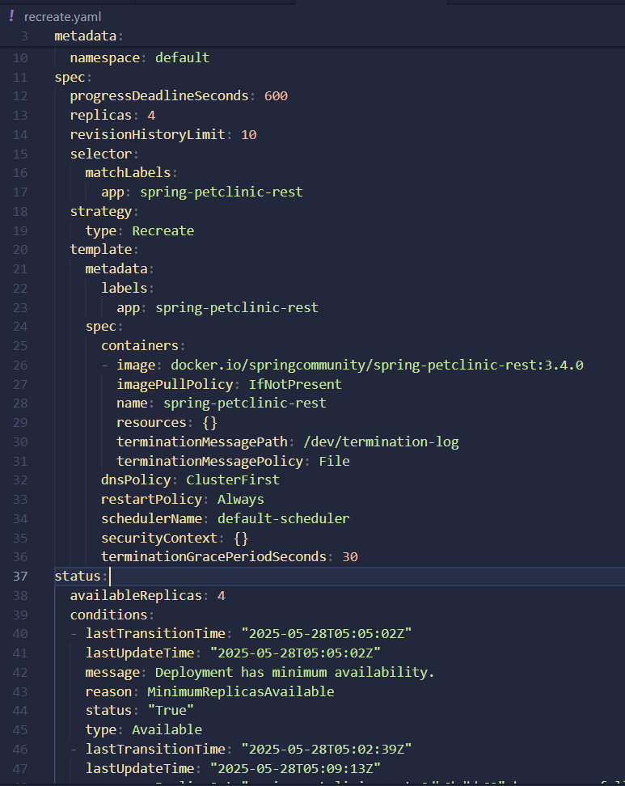
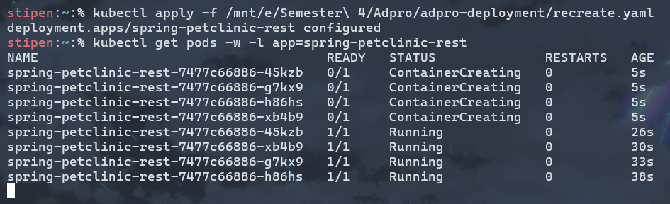
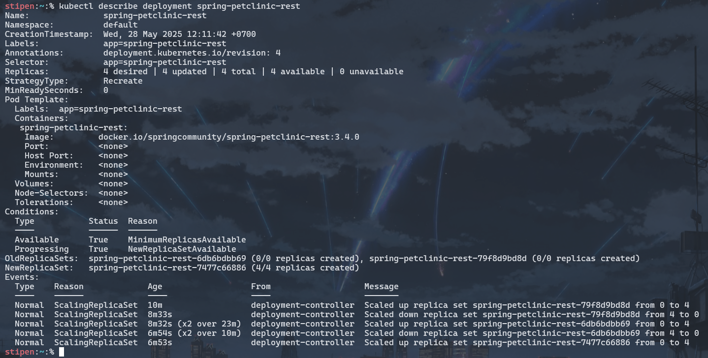

# Reflection

Steven Setiawan, 2306152260

> What do you see in the logs? Does the number of logs increase each time you open the app?


Sebelum aplikasi di-_expose_ sebagai _service_, log hanya menampilkan pesan bahwa HTTP server telah dimulai dan sedang _listen_ di port 8080 serta UDP server di port 8081. Setelah aplikasi di-_expose_ sebagai _service_, kita dapat berinteraksi dengan server dari luas cluster Kubernetes sehingga log mulai mencatat setiap _request_ HTTP yang masuk. Ketika aplikasi dibuka atau di-refresh, jumlah log akan bertambah karena setiap akses mengirimkan HTTP request ke server. Server sendiri memiliki fungsi logging yang mencetak setiap incoming HTTP request beserta timestamp-nya. Dengan demikian, jumlah log akan meningkat setiap kali aplikasi dibuka!

> What is the purpose of the `-n` option and why did the output not list the pods/services that you explicitly created?

Opsi `-n` dalam _command_ `kubectl get` digunakan untuk menentukan namespace tertentu yang ingin kita akses. Ketika menggunakan `-n kube-system`, command tersebut hanya akan menampilkan pods dan services yang berada dalam namespace `kube-system`. Service dan pods yang dibuat secara eksplisit sebelumnya tidak muncul dalam output karena mereka berada di namespace yang berbeda, yaitu namespace `default`. Opsi `-n` berguna ketika terdapat banyak service dengan nama yang sama tersebar di berbagai namespace, sehingga kita dapat memfokuskan pencarian pada namespace tertentu. Selain itu, tanpa opsi `-n`, kubectl secara default akan mengakses namespace default.

> What is the difference between Rolling Update and Recreate deployment strategy?

Rolling Update adalah strategi deployment yang memperbarui pods secara bertahap satu per satu sambil tetap menjalankan pods lama, sehingga aplikasi tetap dapat diakses selama proses update berlangsung. Sebaliknya, recreate deployment strategy menghapus semua pods lama terlebih dahulu, baru kemudian membuat pods baru dengan versi yang telah diperbarui. Perbedaan utama terletak pada adanya downtime, di mana Recreate strategy menyebabkan aplikasi tidak dapat diakses sementara waktu selama proses penghapusan dan pembuatan pods baru, sedangkan Rolling update tidak menyebabkan downtime karena selalu ada pods yang berjalan untuk melayani request selama proses update belrangsung. Recreate strategy cocok untuk aplikasi yang tidak memerlukan high availability, sedangkan Rolling update lebih ideal untuk aplikasi production yang membutuhkan continuous availability.

> Try deploying the Spring Petclinic REST using Recreate deployment strategy and document your attempt.



Pertama-tama, kita ganti terlebih dahulu isi dari deployment.yaml yang kita miliki, seperti perubahan `type` dari `RollingUpdate` ke `Recreate`, menghapus beberapa _metadata fields_, dan menggunakan versi terbaru dari `spring-petclinic-rest`, yaitu v3.4.0.





Setelahnya, kita tinggal apply saja manifest files baru tersebut dengan perintah `kubectl apply -f recreate.yaml`. Nantinya, pods akan dihapus dan pods baru akan dibuat dengan versi 3.4.0 tersebut.

> Prepare different manifest files for executing Recreate deployment strategy.

```yaml
apiVersion: apps/v1
kind: Deployment
metadata:
  annotations:
    deployment.kubernetes.io/revision: "4"
  generation: 5
  labels:
    app: spring-petclinic-rest
  name: spring-petclinic-rest
  namespace: default
spec:
  progressDeadlineSeconds: 600
  replicas: 4
  revisionHistoryLimit: 10
  selector:
    matchLabels:
      app: spring-petclinic-rest
  strategy:
    type: Recreate
  template:
    metadata:
      labels:
        app: spring-petclinic-rest
    spec:
      containers:
      - image: docker.io/springcommunity/spring-petclinic-rest:3.4.0
        imagePullPolicy: IfNotPresent
        name: spring-petclinic-rest
        resources: {}
        terminationMessagePath: /dev/termination-log
        terminationMessagePolicy: File
      dnsPolicy: ClusterFirst
      restartPolicy: Always
      schedulerName: default-scheduler
      securityContext: {}
      terminationGracePeriodSeconds: 30
status:
  availableReplicas: 4
  conditions:
  - lastTransitionTime: "2025-05-28T05:05:02Z"
    lastUpdateTime: "2025-05-28T05:05:02Z"
    message: Deployment has minimum availability.
    reason: MinimumReplicasAvailable
    status: "True"
    type: Available
  - lastTransitionTime: "2025-05-28T05:02:39Z"
    lastUpdateTime: "2025-05-28T05:09:13Z"
    message: ReplicaSet "spring-petclinic-rest-6db6bdbb69" has successfully progressed.
    reason: NewReplicaSetAvailable
    status: "True"
    type: Progressing
  observedGeneration: 5
  readyReplicas: 4
  replicas: 4
  updatedReplicas: 4
```

> What do you think are the benefits of using Kubernetes manifest files? Recall your experience in deploying the app manually and compare it to your experience when deploying the same app by applying the manifest files (i.e., invoking `kubectl apply-f` command) to the cluster.

Kubernetes manifest files memungkinkan kita untuk mendefinisikan _desired state_ aplikasi secara deklaratif, sehingga Kubernetes akan memastikan kondisi aktual aplikasi sesuai dengan yang kita inginkan. Penggunaan manifest files jauh lebih efisien dibandingkan deployment manual karena kita tidak perlu mengingat dan mengetikkan syntax kubectl satu per satu untuk membuat pods, services, dan deployments. Manifest files ini membantu dalam mengurangi risiko human error yang mungkin terjadi saat mengetikkan perintah secara manual, karena konfigurasi sudah terdefinisi jelas dalam file. Reproducibility juga menjadi lebih mudah karena kita dapat dengan mudah mendeploy ulang aplikasi yang sama di cluster berbeda hanya dengan menjalankan `kubectl apply -f`. Proses update, rollback, dan pengelolaan aplikasi juga menjadi lebih konsisten dan dapat dilacak karena semua konfigurasi tersimpan dalam bentuk file yang dapat di-_version control_.