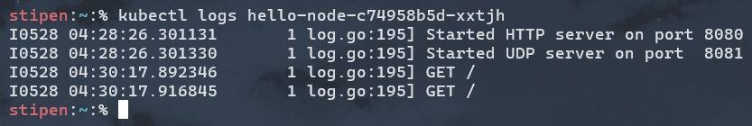

# Reflection

Steven Setiawan, 2306152260

> What do you see in the logs? Does the number of logs increase each time you open the app?

Sebelum aplikasi di-_expose_ sebagai _service_, log hanya menampilkan pesan bahwa HTTP server telah dimulai dan sedang _listen_ di port 8080 serta UDP server di port 8081. Setelah aplikasi di-_expose_ sebagai _service_, kita dapat berinteraksi dengan server dari luas cluster Kubernetes sehingga log mulai mencatat setiap _request_ HTTP yang masuk. Ketika aplikasi dibuka atau di-refresh, jumlah log akan bertambah karena setiap akses mengirimkan HTTP request ke server. Server sendiri memiliki fungsi logging yang mencetak setiap incoming HTTP request beserta timestamp-nya. Dengan demikian, jumlah log akan meningkat setiap kali aplikasi dibuka!

> What is the purpose of the `-n` option and why did the output not list the pods/services that you explicitly created?

Opsi `-n` dalam _command_ `kubectl get` digunakan untuk menentukan namespace tertentu yang ingin kita akses. Ketika menggunakan `-n kube-system`, command tersebut hanya akan menampilkan pods dan services yang berada dalam namespace `kube-system`. Service dan pods yang dibuat secara eksplisit sebelumnya tidak muncul dalam output karena mereka berada di namespace yang berbeda, yaitu namespace `default`. Opsi `-n` berguna ketika terdapat banyak service dengan nama yang sama tersebar di berbagai namespace, sehingga kita dapat memfokuskan pencarian pada namespace tertentu. Selain itu, tanpa opsi `-n`, kubectl secara default akan mengakses namespace default.